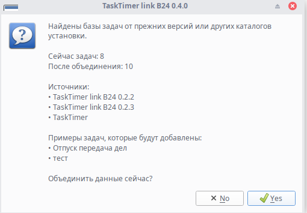
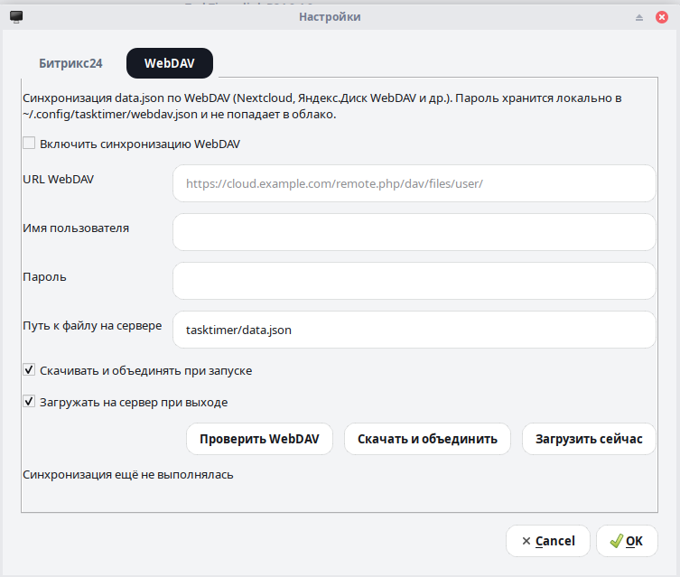

# TaskTimer link B24 — версия 0.4.0

## Что нового

### Обновление без потери старых задач

При установке новой версии программа **ищет** базы задач от прежних установок — например,
каталоги `TaskTimer link B24 0.2.2` или `TaskTimer` в `~/.local/share/timerapp/`.

Если объединение **добавит** задачи в текущую базу, при первом запуске появится **вопрос**:
объединить сейчас или оставить как есть. Отказ запоминается; при появлении новых источников
вопрос покажется снова.

В любой момент: **Настройки → Объединить базы старых версий…** (меню вверху окна).
Перед слиянием показывается, сколько задач сейчас и сколько станет после, и откуда берутся данные.

Автоматического слияния без вашего согласия больше нет — вы сами решаете, когда объединять.



*Пример: найдены базы от версий 0.2.2 и 0.2.3 — программа показывает, сколько задач
сейчас и после слияния, и предлагает объединить.*

### Трей удобнее

- **Щелчок по иконке в трее** разворачивает или сворачивает главное окно (как переключатель).
- Плавающий виджет по-прежнему скрывается после **завершения** задачи; лишних уведомлений
  при сворачивании без активного таймера нет.

### Из версии 0.3.0 (если пропустили)

- Синхронизация базы задач через **WebDAV** между компьютерами.
- Пароли Битрикс24 и WebDAV хранятся отдельно от `data.json` в облаке.
- Надёжнее синхронизация при нестабильном соединении.



*В настройках WebDAV можно включить автоматическое скачивание и объединение при запуске
или нажать «Скачать и объединить» вручную.*

---

## Кому подойдёт обновление

- Обновляетесь с **0.2.x или 0.3.x** и хотите **подтянуть задачи** из старых каталогов данных.
- Пользуетесь **треем** и хотите быстро показывать/скрывать окно одним щелчком.
- Работаете на **нескольких компьютерах** с WebDAV — всё из 0.3.0 сохранено.

---

## Как обновиться

1. Скачайте пакет для Linux (64-bit):

   [tasktimer-link-b24-0.4.0-amd64.deb](https://github.com/alexandrgert/timer-app/releases/download/v0.4.0/tasktimer-link-b24-0.4.0-amd64.deb)

2. Установите:

   ```bash
   sudo dpkg -i tasktimer-link-b24-0.4.0-amd64.deb
   sudo apt-get install -f
   ```

3. Запустите **TaskTimer link B24** из меню или командой `tasktimer-link-b24`.

**Текущая база задач сохранится.** Если найдутся данные от старых версий, программа предложит
их объединить — можно согласиться или отложить.

---

## На что обратить внимание

- Объединение **не удаляет** старые файлы сразу — копии источников сохраняются в каталоге
  резервных копий рядом с `data.json`.
- При **WebDAV** по-прежнему не запускайте одну задачу одновременно на двух компьютерах.
- Пароли и вебхук настраиваются **на каждом компьютере** отдельно (или переносятся вручную).

---

## Подробная инструкция

[ИНСТРУКЦИЯ.md](../ИНСТРУКЦИЯ.md) — задачи, Битрикс24, трей, WebDAV и слияние баз простым языком.
